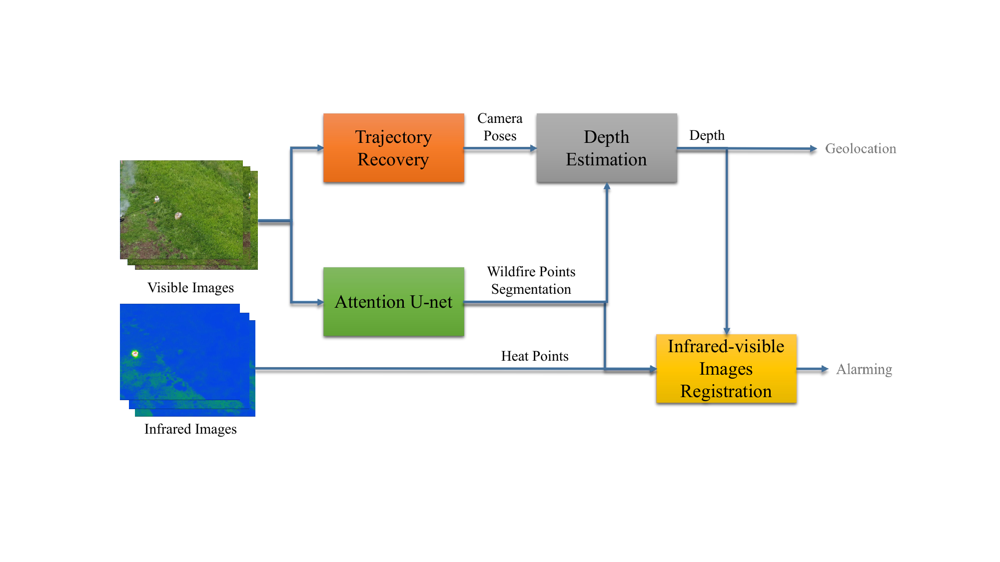
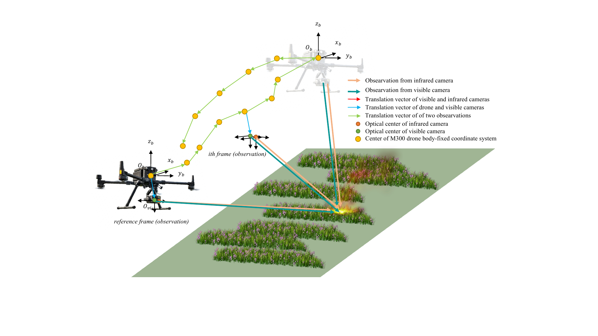
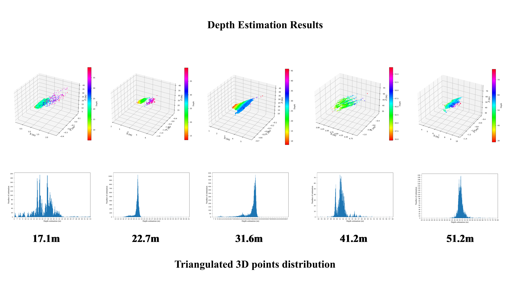

# Early wildfire point perception methods

## [Outdoor experiment video](https://www.youtube.com/user/NAVConcordia)

## Preception Methods overview

  

**In this work, we implemented several functions based on DJI M300 Drone and H20T camera for the early wildfire point
preception applications:**

- The wildfire point is firstly segmented by CNN-based networks to provide the semantic information for the other
  submodules in the framework.

- After the the indoor calibration, the preceis camera trajectory with correct scale is recoveried by ORB-SLAM2 and
  drone platformation navigation information. The the depth is estimated.

- A model based Visible-infrared images registration is proposed to fuse the two types of information to reduce the
  false positive alram further.

## Features

| functions                                            | results                                   |
| ---------------------------------------------------- | ----------------------------------------- |
| Attention gate U-net wildfire segmentation           |  |
| Trianglulation-based wildfire point depth estimation |                |
| Visible-infrared camera system calibration           |     |
| Model-based wide fire point registration             |                |

## Realted Works

- We use the [forest fire detection ststom](https://github.com/ConcordiaNAVlab/forest_fire_detection_system) to control
  M300 and capture the data during the trajectory.

## Hardware

- [DJI M300 RTK](https://www.dji.com/ca/matrice-300)
- [DJI H20T Camera](https://www.dji.com/ca/zenmuse-h20-series)
- Nvidia NX on board computer

## Software

- [ORB-SLAM2](https://github.com/raulmur/ORB_SLAM2)
- [g2o](https://github.com/RainerKuemmerle/g2o)
- [OpenCV](https://github.com/opencv/opencv)
- [Pytorch](https://pytorch.org/)

## How to build

For each submodules:

1. `cd <submodules>`
2. `mkdir -p build&&cd build`
3. `cmake cmake -DCMAKE_EXPORT_COMPILE_COMMANDS=1 -DCMAKE_BUILD_TYPE=Release ..`

The executable file will be generated under `<submodules>/bin` directory.

## Copyright

**Copyright (C) 2022 Concordia NAVlab. All rights reserved.**
